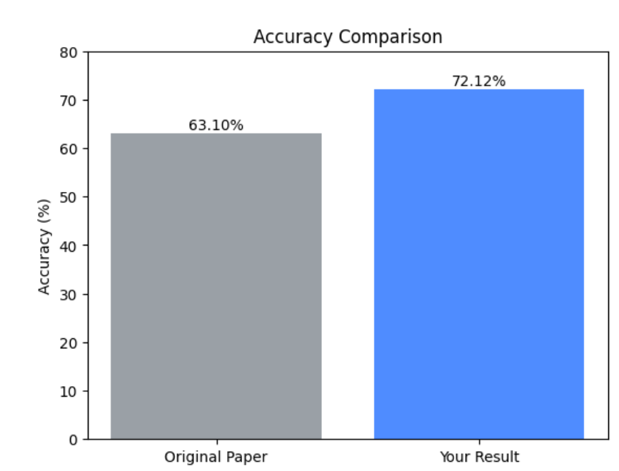

# 复现基本信息
github:
https://github.com/bowang-lab/MedRAX  
  
Paper:
https://arxiv.org/pdf/2502.02673  
  
数据集：
https://huggingface.co/datasets/wanglab/chest-agent-bench  


# 1.环境安装Install
```
# Clone the repository
git clone https://github.com/bowang-lab/MedRAX.git
cd MedRAX

# Install package
pip install -e .
```
# 2.data介绍与上传
用到的数据集：Eurorad的部分，为胸部X光数据。  
  
测试集：图像：同上，832MB，数据格式jpg。问题：代码库里的json  
  
标签：和question在同一个json里  

# 3.复现步骤实现
## 3.1 下载数据集
```
huggingface-cli download wanglab/chestagentbench --repo-type dataset --local-dir chestagentbench
unzip chestagentbench/figures.zip
```


## 3.2  设置LLM API
```
export OPENAI_BASE_URL="https://dashscope.aliyuncs.com/compatible-mode/v1"
export OPENAI_API_KEY="<your-dashscope-api-key>"
export OPENAI_MODEL="qwen3-vl-235b-a22b-instruct"
```

## 3.3 testing
```
python /root/autodl-tmp/MedRAX-main/try2.py
```


## 报错
### 3.3.1

```
root@autodl-container-183e4a8bdb-21c6026f:~/autodl-tmp/MedRAX-main# python /root/autodl-tmp/MedRAX-main/main.py
Traceback (most recent call last):
  File "/root/autodl-tmp/MedRAX-main/main.py", line 5, in <module>
    from transformers import logging
ModuleNotFoundError: No module named 'transformers'
root@autodl-container-183e4a8bdb-21c6026f:~/autodl-tmp/MedRAX-main# python /root/autodl-tmp/MedRAX-main/main.py
Traceback (most recent call last):
  File "/root/autodl-tmp/MedRAX-main/main.py", line 5, in <module>
    from transformers import logging
ImportError: cannot import name 'logging' from 'transformers' (unknown location)
root@autodl-container-183e4a8bdb-21c6026f:~/autodl-tmp/MedRAX-main# transformers在/root/autodl-tmp/MedRAX-main/transformers
之前配置环境时transformer用huggingface下载，但是登不上外网所以下载失败
解决：
pip install transformers
```
### 3.3.2
```
Error processing case 17221, question 17221_8143559684997: Error code: 400 - {'error': {'message': '<400> InternalError.Algo.InvalidParameter: Failed to download multimodal content', 'type': 'invalid_request_error', 'param': None, 'code': 'invalid_parameter_error'}, 'id': 'chatcmpl-a29c0495-bcea-4f12-a14a-855546e84d50', 'request_id': 'a29c0495-bcea-4f12-a14a-855546e84d50'} Progress: Case 5/609, Question 20/2500 Case ID: 17221 Question ID: 17221_8143559684997 Final Response: Model Answer: Correct Answer: A
访问图片url失败，
解决方法：1.用国内url,依旧失败

2.
def add_image_as_base64(content, image_bytes):
    b64 = base64.b64encode(image_bytes).decode("utf-8")
    content.append({
        "type": "image_url",
        "image_url": {
            "url": f"data:image/jpeg;base64,{b64}"
        }
    })
if "url" in subfig:
    try:
        image_urls.append(url_to_data_uri(subfig["url"]))
    except Exception as e:
        print(f"Failed to load image {subfig['url']}: {e}")
```
### 3.3.3
```
--questions_file /root/autodl-tmp/MedRAX-main/chestagentbench/metadata.jsonl \
  --output_file results.jsonl \
  --model_name qwen3-vl-235b-a22b-instruct \
  --temperature 0.2
Downloading weights...
If this fails you can run `wget https://github.com/mlmed/torchxrayvision/releases/download/v1/nih-pc-chex-mimic_ch-google-openi-kaggle-densenet121-d121-tw-lr001-rot45-tr15-sc15-seed0-best.pt -O /root/.torchxrayvision/models_data/nih-pc-chex-mimic_ch-google-openi-kaggle-densenet121-d121-tw-lr001-rot45-tr15-sc15-seed0-best.pt`
/root/miniconda3/envs/medrax/lib/python3.10/site-packages/torch/cuda/__init__.py:235: UserWarning: 
NVIDIA RTX PRO 6000 Blackwell Server Edition with CUDA capability sm_120 is not compatible with the current PyTorch installation.
The current PyTorch install supports CUDA capabilities sm_50 sm_60 sm_70 sm_75 sm_80 sm_86 sm_90.
If you want to use the NVIDIA RTX PRO 6000 Blackwell Server Edition GPU with PyTorch, please check the instructions at https://pytorch.org/get-started/locally/

  warnings.warn(
Traceback (most recent call last):
  File "/root/miniconda3/envs/medrax/lib/python3.10/site-packages/urllib3/connectionpool.py", line 787, in urlopen
    response = self._make_request(
  File "/root/miniconda3/envs/medrax/lib/python3.10/site-packages/urllib3/connectionpool.py", line 534, in _make_request
    response = conn.getresponse()
  File "/root/miniconda3/envs/medrax/lib/python3.10/site-packages/urllib3/connection.py", line 571, in getresponse
    httplib_response = super().getresponse()
  File "/root/miniconda3/envs/medrax/lib/python3.10/http/client.py", line 1375, in getresponse
    response.begin()
  File "/root/miniconda3/envs/medrax/lib/python3.10/http/client.py", line 318, in begin
    version, status, reason = self._read_status()
  File "/root/miniconda3/envs/medrax/lib/python3.10/http/client.py", line 287, in _read_status
    raise RemoteDisconnected("Remote end closed connection without"
http.client.RemoteDisconnected: Remote end closed connection without response

During handling of the above exception, another exception occurred:

Traceback (most recent call last):
  File "/root/miniconda3/envs/medrax/lib/python3.10/site-packages/requests/adapters.py", line 644, in send
    resp = conn.urlopen(
  File "/root/miniconda3/envs/medrax/lib/python3.10/site-packages/urllib3/connectionpool.py", line 841, in urlopen
    retries = retries.increment(
  File "/root/miniconda3/envs/medrax/lib/python3.10/site-packages/urllib3/util/retry.py", line 474, in increment
    raise reraise(type(error), error, _stacktrace)
  File "/root/miniconda3/envs/medrax/lib/python3.10/site-packages/urllib3/util/util.py", line 38, in reraise
    raise value.with_traceback(tb)
  File "/root/miniconda3/envs/medrax/lib/python3.10/site-packages/urllib3/connectionpool.py", line 787, in urlopen
    response = self._make_request(
  File "/root/miniconda3/envs/medrax/lib/python3.10/site-packages/urllib3/connectionpool.py", line 534, in _make_request
    response = conn.getresponse()
  File "/root/miniconda3/envs/medrax/lib/python3.10/site-packages/urllib3/connection.py", line 571, in getresponse
    httplib_response = super().getresponse()
  File "/root/miniconda3/envs/medrax/lib/python3.10/http/client.py", line 1375, in getresponse
    response.begin()
  File "/root/miniconda3/envs/medrax/lib/python3.10/http/client.py", line 318, in begin
    version, status, reason = self._read_status()
  File "/root/miniconda3/envs/medrax/lib/python3.10/http/client.py", line 287, in _read_status
    raise RemoteDisconnected("Remote end closed connection without"
urllib3.exceptions.ProtocolError: ('Connection aborted.', RemoteDisconnected('Remote end closed connection without response'))

During handling of the above exception, another exception occurred:

Traceback (most recent call last):
  File "/root/autodl-tmp/MedRAX-main/try.py", line 144, in <module>
    agent, tools_dict = initialize_agent(
  File "/root/autodl-tmp/MedRAX-main/try.py", line 52, in initialize_agent
    tools_dict[t] = all_tools[t]()
  File "/root/autodl-tmp/MedRAX-main/try.py", line 38, in <lambda>
    "ChestXRayClassifierTool": lambda: ChestXRayClassifierTool(device=device),
  File "/root/autodl-tmp/MedRAX-main/medrax/tools/classification.py", line 55, in __init__
    self.model = xrv.models.DenseNet(weights=model_name)
  File "/root/miniconda3/envs/medrax/lib/python3.10/site-packages/torchxrayvision/models.py", line 305, in __init__
    self.weights_filename_local = get_weights(weights, cache_dir)
  File "/root/miniconda3/envs/medrax/lib/python3.10/site-packages/torchxrayvision/models.py", line 545, in get_weights
    utils.download(url, weights_filename_local)
  File "/root/miniconda3/envs/medrax/lib/python3.10/site-packages/torchxrayvision/utils.py", line 34, in download
    response = requests.get(url, stream=True)
  File "/root/miniconda3/envs/medrax/lib/python3.10/site-packages/requests/api.py", line 73, in get
    return request("get", url, params=params, **kwargs)
  File "/root/miniconda3/envs/medrax/lib/python3.10/site-packages/requests/api.py", line 59, in request
    return session.request(method=method, url=url, **kwargs)
  File "/root/miniconda3/envs/medrax/lib/python3.10/site-packages/requests/sessions.py", line 589, in request
    resp = self.send(prep, **send_kwargs)
  File "/root/miniconda3/envs/medrax/lib/python3.10/site-packages/requests/sessions.py", line 703, in send
    r = adapter.send(request, **kwargs)
  File "/root/miniconda3/envs/medrax/lib/python3.10/site-packages/requests/adapters.py", line 659, in send
    raise ConnectionError(err, request=request)
requests.exceptions.ConnectionError: ('Connection aborted.', RemoteDisconnected('Remote end closed connection without response'))
(medrax) root@autodl-container-183e4a8bdb-21c6026f:~/autodl-tmp#
工具权重因为从huggingface下所以失败
解决：下到本地后上传
self.model = xrv.models.DenseNet(weights='densenet121-res224-mimic_ch')
```
### 3.3.4
```
rax) root@autodl-container-183e4a8bdb-21c6026f:~/autodl-tmp# python /root/autodl-tmp/MedRAX-main/try.py \
  --questions_file /root/autodl-tmp/MedRAX-main/chestagentbench/metadata.jsonl \
  --output_file results.jsonl \
  --model_name qwen3-vl-235b-a22b-instruct \
  --temperature 0.2
Traceback (most recent call last):
  File "/root/autodl-tmp/MedRAX-main/try.py", line 158, in <module>
    questions = json.load(f)
  File "/root/miniconda3/envs/medrax/lib/python3.10/json/__init__.py", line 293, in load
    return loads(fp.read(),
  File "/root/miniconda3/envs/medrax/lib/python3.10/json/__init__.py", line 346, in loads
    return _default_decoder.decode(s)
  File "/root/miniconda3/envs/medrax/lib/python3.10/json/decoder.py", line 340, in decode
    raise JSONDecodeError("Extra data", s, end)
json.decoder.JSONDecodeError: Extra data: line 2 column 1 (char 1830)
/root/miniconda3/envs/medrax/lib/python3.10/site-packages/torch/cuda/__init__.py:235: UserWarning: 
NVIDIA RTX PRO 6000 Blackwell Server Edition with CUDA capability sm_120 is not compatible with the current PyTorch installation.
The current PyTorch install supports CUDA capabilities sm_50 sm_60 sm_70 sm_75 sm_80 sm_86 sm_90.
If you want to use the NVIDIA RTX PRO 6000 Blackwell Server Edition GPU with PyTorch, please check the instructions at https://pytorch.org/get-started/locally/

  warnings.warn(
(medrax) root@autodl-container-183e4a8bdb-21c6026f:~/autodl-tmp#
/root/autodl-tmp/MedRAX-main/chestagentbench/metadata.jsonl 不是标准的 JSON 文件，而很可能是 JSON Lines 格式（每行一个 JSON 对象）。
解决
import jsonlines

with jsonlines.open("/root/autodl-tmp/MedRAX-main/chestagentbench/metadata.jsonl") as reader:
    questions = [obj for obj in reader]
Evaluation
python /root/autodl-tmp/MedRAX-main/vval.py medrax_log.json
```
## 3.4 Results
指标为MAE 
|       | 主表   | 我的    |
| ----- | ------ | ------- |
| accuracy | 63.1% | 72.12% |  



## web复现
[▶ Click here to watch the demo video](lv_0_20260202221020.gif)  
报错：库版本问题，尝试多个版本后成功
