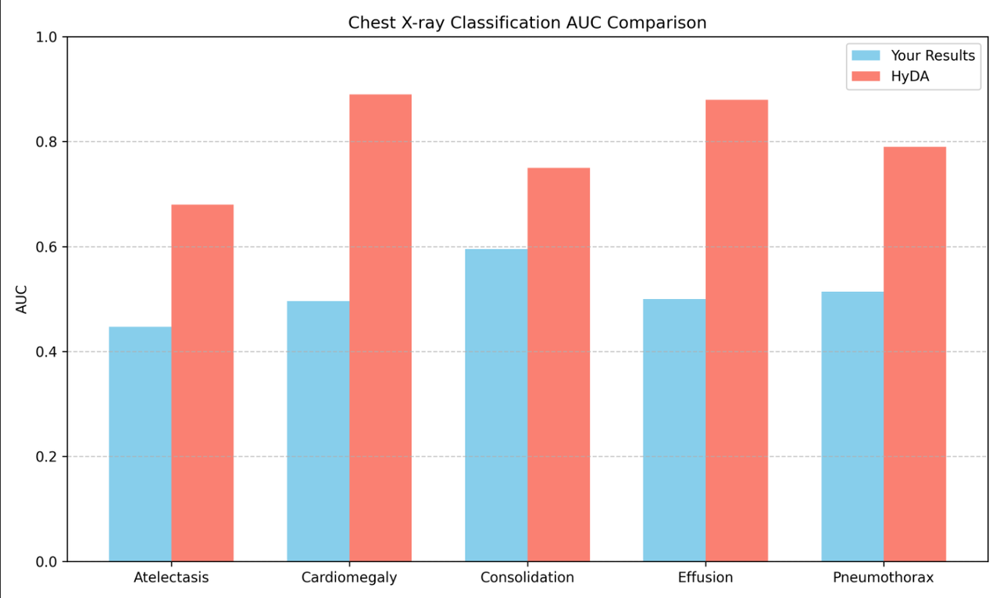

# 复现基本信息
github:
https://github.com/doronser/hyda  
  
Paper:
https://papers-pdfs.assets.alphaxiv.org/2503.04979v1.pdf  
  
数据集：  
vinb:
https://www.kaggle.com/datasets/xhlulu/vinbigdata-chest-xray-resized-png-1024x1024?select=train  
  
NIH：
https://nihcc.app.box.com/v/ChestXray-NIHCC/folder/36938765345  


# 1.环境安装Install
```
# Clone the repository
git clone https://github.com/doronser/hyda.git
cd hyda
# Create a conda environment
conda create -n hyda python=3.10
conda activate hyda

# Install requirements
pip install -r requirements.txt
```
# 2.data介绍与上传
用到的数据集：NIH,VinBigData Chest X-ray为胸部X光数据。  
训练集：VinBigData Chest X-ray的训练集，8GB，数据格式．png   
测试集：NIH的001号压缩包（NIH由很多数据压缩包组成）,1.9GB，数据格式．  
标签：均为．csv文件  

# 3.复现步骤实现
## 3.1classfier training
## 报错
### 3.1.1
问题：TypeError: can't multiply sequence by non-int of type 'float'，放标签的.csv文件是字符
解决方法：把改成float
### 3.1.2

```
问题:
error: Parser key "model":
  Does not validate against any of the Union subtypes
  Given value type: <class 'dict'>
  Given value: {'class_path': 'chest_xray.pl_modules.DomainClassifier', ... }
＃LightningCLI 期望 --model 是 路径字符串或 LightningModule 实例，而给的 config 文件里 model 是一个嵌套字典 (class_path + init_args)。

也就是说， domain_clf.yaml 里的 model: 配置，格式不符合 LightningCLI 期望的格式。

解决方法：
cli = CLI(
    model_class=LightningModule,＃改成DomainClassifier
    subclass_mode_model=True,
    save_config_callback=SaveConfigWandB
)
```
### 3.1.3
```
问题：
Assertion `t >= 0 && t < n_classes` failed
标签和模型输出类别数不匹配

解决方法：
验证集设置错误，改一下验证集
```
### 3.1.4
```
问题：
ValueError: Does not validate against any of the Union subtypes
Subtypes: [<class 'NoneType'>, <class 'lightning.pytorch.core.module.LightningModule'>]
Errors:
  - Expected a <class 'NoneType'>
  - 'init_args'
Given value type: <class 'jsonargparse._namespace.Namespace'>
Given value: Namespace(class_path='chest_xray.pl_modules.DomainConditionedCXRLitModule', init_args=Namespace(...))

解决方法：这是用ctrl C中断训练导致权重不完整导致的，完整训练就可以
```
###3.1.5
```
问题：
KeyError: np.int64(1)
wandb.log({"conf_mat": confusion_matrix(preds=val_domain_preds, y_true=val_domain_labels, class_names=self.cls_names)})

解决方法：
类别映射那里修改了一下并且如果训练时只有一个域就不画混淆矩阵
```
## 3.2 HyDA model training
```
python train.py fit -c chest_xray/configs/hyper.yaml \
    --data.init_args.target_domain NIH \
    --model.init_args.target_domain NIH \
    --model.init_args.dom_clf_ckpt <domain_classifier_checkpoint>
    
    
python /root/autodl-tmp/hyda-main/train.py fit \
-c /root/autodl-tmp/hyda-main/chest_xray/configs/hyper1.yaml \
--data.init_args.target_domain NIH \
--model.init_args.target_domain NIH \
cxr_hyda
```
## 报错
### 3.2.1
```
问题:
Validation failed: Key 'encoder.init_args.activation' is not expected
＃传入的 YAML 配置或者命令行参数和 Lightning CLI/jsonargparse 期望的格式完全不匹配

解决方法：yaml里model部分不使用嵌套格式
```

## 3.3 finetune and evalute
代码库里没有测试代码，让gpt生成了一个
## 3.4 Results
指标为AUC，越高越好，target domain为NIH  
|      | 类别一 | 类别二 | 类别三 | 类别四 | 类别五 |
| ---- | ---- | ---- | ---- | ---- | ---- |
| 本文 | 0.68 | 0.89 | 0.75 | 0.88 | 0.79 |
| 我的 | 0.447 | 0.4963 | 0.5954 | 0.4997 | 0.5137 |  


