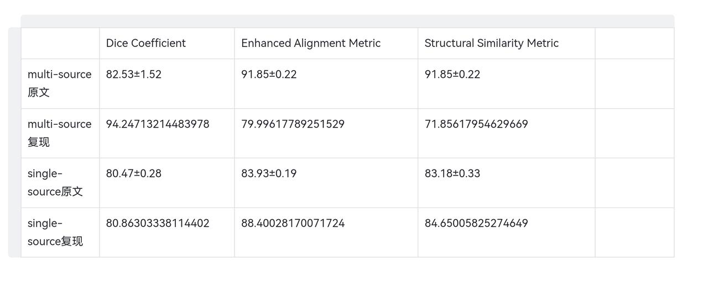
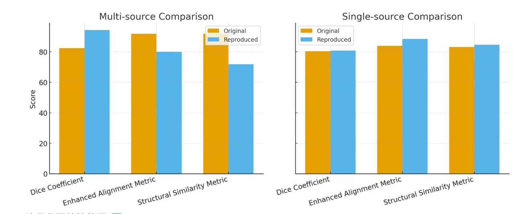

# 复现基本信息
github:
https://github.com/Yore0/TTDG-MGM  
  
Paper:
https://www.alphaxiv.org/abs/2503.13012 
  
数据集：
https://drive.google.com/drive/folders/1axgu3-65un-wA_1OH-tQIUIEHEDrnS_-  
  
Fundus(眼底)的数据集和Polyp(息肉)的数据集都在里面  
  
Fundus：RIM-ONE,REFUGE,ORIGA,REFUGE-TEST,Drishti-GS  
  
Polyp：BKAI-IGH-NEOPolyp,CVC-ClinicDB,ETIS,Kvasir  
  


# 1.环境安装Install
```
conda create -n ttdg python=3.7 -y
conda activate ttdg
pip install -r requirements.txt
```
# 2.data介绍与上传
## multi-source generalization
用到的数据集：Fundus的数据集。REFUGE, ORIGA,  Drishti_GS,RIM_ONE_r3      没说模态，是2D的，一共1.01GB  
训练集：REFUGE(均为png),       ORIGA(图像jpg,标签png,77M),     Drishti_GS(图像标签均为png，63M)，  
| 训练集 | 格式 | 内存 |
| ---- | ---- | ---- |
| REFUGE | 均为png | 820M |
| ORIGA | 图像jpg,标签png | 77 |
| Drishti_GS | 图像标签均为png | 63 |  

测试集：RIM_ONE_r3，标签和image为.png，内存120M


## single-source generalization​
用到的数据集：Polyp的数据集。BKAI-IGH-NEOPolyp,CVC-ClinicDB      没说模态，是2D的，一共367M  
测试集：BKAI-IGH-NEOPolyp          image和label为jpeg    302M  
训练集：CVC-ClinicDB                    均为png         65M     

# 3.复现步骤实现
## 3.1 COCO 格式json构建
```
import os
import cv2
import json
import numpy as np
from glob import glob

def masks_to_coco(image_dir, mask_dir, output_json, min_area=200):
    """
    将多类别（OD=128, OC=255）掩码转换为 COCO 格式
    - 使用形态学闭运算平滑轮廓
    - 忽略面积过小的伪影区域
    - 每张图只保留一个 OD 和一个 OC（取最大面积）
    """
    images = []
    annotations = []
    categories = [
        {"id": 1, "name": "OpticDisc", "supercategory": "fundus"},
        {"id": 2, "name": "OpticCup", "supercategory": "fundus"}
    ]

    ann_id = 1
    img_id = 1

    image_files = sorted(glob(os.path.join(image_dir, "*.png")) + 
                         glob(os.path.join(image_dir, "*.jpg")))

    for file in image_files:
        filename = os.path.basename(file)
        mask_file = os.path.join(mask_dir, filename.replace(".jpg", ".png"))
        if not os.path.exists(mask_file):
            print(f"[WARN] 找不到对应掩码: {mask_file}")
            continue

        img = cv2.imread(file)
        if img is None:
            print(f"[WARN] 无法读取图像: {file}")
            continue

        h, w = img.shape[:2]
        images.append({
            "id": img_id,
            "file_name": filename,
            "width": w,
            "height": h
        })

        # 读取掩码
        mask = cv2.imread(mask_file, cv2.IMREAD_GRAYSCALE)
        if mask is None:
            print(f"[WARN] 无法读取掩码: {mask_file}")
            continue

        # 形态学闭运算核
        kernel = np.ones((5, 5), np.uint8)

        for cat_id, pixel_val in [(1, 128), (2, 255)]:
            binary_mask = (mask == pixel_val).astype('uint8')

            # 🔹 闭运算 (去小孔、连通小块)
            binary_mask = cv2.morphologyEx(binary_mask, cv2.MORPH_CLOSE, kernel)

            # 连通区域分析
            num_labels, labels, stats, _ = cv2.connectedComponentsWithStats(binary_mask, connectivity=8)

            if num_labels <= 1:
                continue  # 无前景

            # 找最大区域（主目标）
            areas = stats[1:, cv2.CC_STAT_AREA]
            largest_idx = np.argmax(areas) + 1  # +1 因为 stats[0] 是背景
            largest_mask = (labels == largest_idx).astype('uint8')

            # 提取轮廓
            contours, _ = cv2.findContours(largest_mask, cv2.RETR_EXTERNAL, cv2.CHAIN_APPROX_SIMPLE)
            if len(contours) == 0:
                continue

            contour = max(contours, key=cv2.contourArea)
            area = cv2.contourArea(contour)
            if area < min_area:
                continue  # 忽略太小的区域

            x, y, bw, bh = cv2.boundingRect(contour)
            segmentation = contour.flatten().tolist()

            annotations.append({
                "id": ann_id,
                "image_id": img_id,
                "category_id": cat_id,
                "segmentation": [segmentation],
                "bbox": [x, y, bw, bh],
                "area": float(area),
                "iscrowd": 0
            })
            ann_id += 1

        img_id += 1

    # === 写出 COCO JSON ===
    coco_dict = {
        "images": images,
        "annotations": annotations,
        "categories": categories
    }

    os.makedirs(os.path.dirname(output_json), exist_ok=True)
    with open(output_json, "w") as f:
        json.dump(coco_dict, f, indent=4)

    print(f"[INFO] ✅ 已生成: {output_json}, 图片数={len(images)}, 标注数={len(annotations)}")


if __name__ == "__main__":
    root = "/root/autodl-tmp/datasets/Fundus"

    datasets = [
        "Drishti_GS/test",
        "Drishti_GS/train",
        "ORIGA/test",
        "ORIGA/train",
        "REFUGE/test",
        "REFUGE/train",
        "REFUGE_Valid",
        "RIM_ONE_r3/test",
        "RIM_ONE_r3/train"
    ]

    for dataset in datasets:
        img_dir = os.path.join(root, dataset, "image")
        mask_dir = os.path.join(root, dataset, "mask")
        output_json = os.path.join(root, dataset.replace("/", "_") + ".json")
        masks_to_coco(img_dir, mask_dir, output_json)
```
## 报错
### 3.1.1
```
问题：polyp标注数大于图片数，但一个图片应该只有一个标注
原因：(ttdg) root@autodl-container-0fc04ca4ba-2313fd84:~/autodl-tmp# 
python /root/autodl-tmp/plpolypdajs.py unique pixel values: 
[ 0 1 2 3 4 5 6 7 8 248 249 250 251 252 253 254 255] connected components (excluding bg): 1 findContours returned: 1
掩码不是纯黑白二值图，而是被保存成了灰度渐变或者有轻微压缩误差的图像（比如 JPEG 保存过、或者 PNG 压缩出了一堆伪像）。

解决方法：强行二值化
mask = cv2.imread(mask_file, cv2.IMREAD_GRAYSCALE)
mask = np.where(mask > 128, 255, 0).astype(np.uint8)
```
### 3.1.2
```
问题:
fundus的标注数量应该是图片数量两倍，但是多很多

原因：把很小的连通区域也标进去了

解决方法：
忽略小碎片
num_labels, labels = cv2.connectedComponents(binm)
area_thresh = binm.size * 0.001  # 小于0.1%像素面积的忽略
counts = 0
for i in range(1, num_labels):
    if np.sum(labels == i) >= area_thresh:
        counts += 1

```
```
问题：
Assertion `t >= 0 && t < n_classes` failed
标签和模型输出类别数不匹配

解决方法：
验证集设置错误，改一下验证集
```
```
问题：
ValueError: Does not validate against any of the Union subtypes
Subtypes: [<class 'NoneType'>, <class 'lightning.pytorch.core.module.LightningModule'>]
Errors:
  - Expected a <class 'NoneType'>
  - 'init_args'
Given value type: <class 'jsonargparse._namespace.Namespace'>
Given value: Namespace(class_path='chest_xray.pl_modules.DomainConditionedCXRLitModule', init_args=Namespace(...))

解决方法：这是用ctrl C中断训练导致权重不完整导致的，完整训练就可以
```
```
问题：
KeyError: np.int64(1)
wandb.log({"conf_mat": confusion_matrix(preds=val_domain_preds, y_true=val_domain_labels, class_names=self.cls_names)})

解决方法：
类别映射那里修改了一下并且如果训练时只有一个域就不画混淆矩阵
```
## 3.2  training
python train_net.py \
      --num-gpus 1 \
      --config configs/seg_res50fpn_source.yaml\
      OUTPUT_DIR output/<name>
## 报错
### 3.2.1
```
问题:
RuntimeError(CUDA_MISMATCH_MESSAGE.format(cuda_str_version, torch.version.cuda))
 RuntimeError: The detected CUDA version (12.1) mismatches the version that was used to compile PyTorch (11.3). Please make sure to use the same CUDA versions. 
[end of output] note: This error originates from a subprocess, and is likely not a problem with pip.
＃你的代码 README 指定 Detectron2 0.5

你服务器上 PyTorch 是 1.10 + CUDA 11.3

你服务器的 GPU 是 RTX 3080 Ti（sm_86）

你之前尝试安装 Detectron2 0.5 都因为网络问题或者 CUDA 版本不匹配失败

解决方法：
使用和pytorch和cuda匹配的detectron2版本，然后改用0.5版本的语句
pip install detectron2==0.6 -f https://dl.fbaipublicfiles.com/detectron2/wheels/cu113/torch1.10/index.html

# adapteacher/modeling/roi_heads/fast_rcnn.py
# 将：
# from detectron2.modeling.roi_heads.fast_rcnn import FastRCNNOutputs
# 改为：
from detectron2.modeling.roi_heads.fast_rcnn import FastRCNNOutputLayers
```


### 3.2.2
```
问题：显存不足
解决方法：改patch 大小
```
## 3.3 finetune and evalute
```
python train_net.py --eval-only --config configs/test_segment.yaml \
                MODEL.WEIGHTS <your weight>.pth
```
## 报错
### 3.3.1
效果差很多  
解决方法：把学习率根据GPU数量改一下，patch的大小改成原文用的其他文献中的大小
## 3.4 Results
指标为Dice score (DSC, %)， Emax(一个论文提出的)， Sα(一个论文提出的)，越高越好  
  



